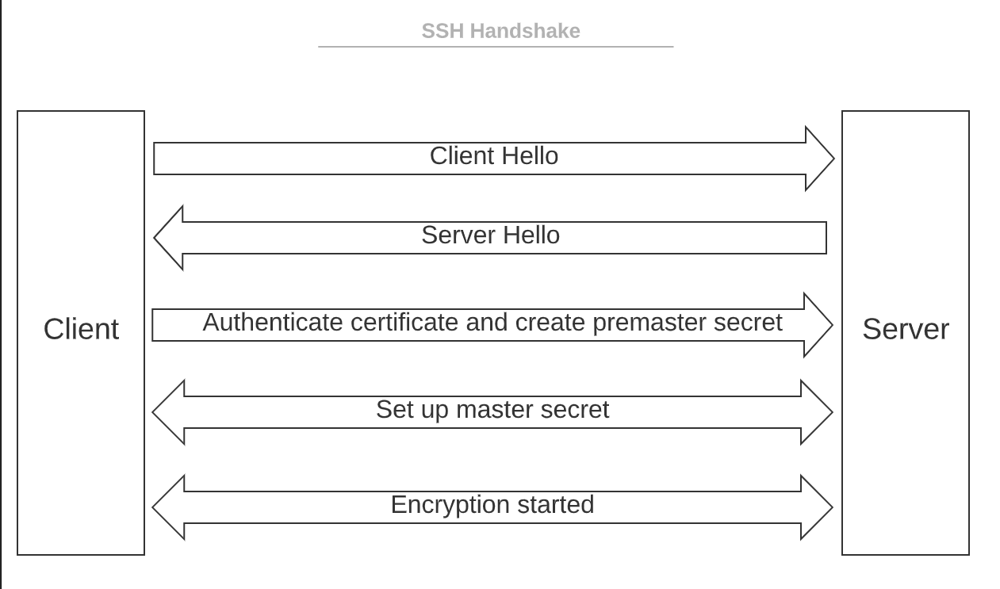

# MISE EN PRODUCTION D'UNE APPLICATION

## Connection à un serveur distant avec SSH et administration Linux

Source :
- https://www.youtube.com/watch?v=gxQKw7A6qDM --> intro sur le SSH
- https://www.hostinger.fr/tutoriels/ssh-linux --> introduction sur le ssh
- https://doc.ubuntu-fr.org/ssh --> connexion via ssh

### En quoi ça consiste ?
Tout simplement de rendre l'application qui marche uniquement sur votre ordi (en locale) accessible à tout le monde

### SSH c'est quoi ?
SSH, ou Secure Shell, est un protocole d’administration à distance qui permet aux utilisateurs de contrôler et de modifier leurs serveurs distants sur Internet.

### Quels sont les protocoles qui ont été remplacés par SSH ?
Les protocoles qui ont été remplacés par SSH sont le TELNET (non chiffré) ainsi que le FTP.

Le protocole SSH, utilise des techniques cryptographiques pour s’assurer que toutes les communications vers et depuis le serveur distant se produisent de manière chiffrée, et donc apporte plus de sécurité lors de l'administration de serveurs distants.  
Il fournit un mécanisme pour authentifier un utilisateur distant, transférer les entrées du client vers l’hôte et relayer la sortie vers le client.

### Quelles sont les différents modes d’utilisation de SSH (notamment au niveau de la sécurité) ?

Les différents modes d'utilisation de SSH sont :
- authentification par mot de passe
- authentification par clé publique / privée

**A retenir** : L’avantage important offert par SSH par rapport à ses prédécesseurs est l’utilisation du cryptage pour assurer le transfert sécurisé d’informations entre l’hôte et le client

### Comprendre différentes techniques de cryptage utilisées par SSH

#### Cryptage symétrique
voir source

#### Cryptage asymétrique
voir source

#### Hashing
voir source

### Comment est établie une connection SSH entre un client et un serveur avec la méthode la plus sécurisé (faites un schéma)

### Liste de commandes Linux
Source :
https://www.hostinger.fr/tutoriels/commandes-linux

| Catégorie                                                                                                              | Ligne de commande |
|------------------------------------------------------------------------------------------------------------------------|:-----------------:|
| Affiche les fichiers et folders                                                                                        |        ls         |
| Change de répertoire courant                                                                                           |        cd         |
| Trouver le chemin de votre répertoire de travail actuel                                                                |        pwd        |
| Copier des fichiers ou des folders et leur contenu                                                                     |        cp         |
| Créer un folder                                                                                                        |       mkdir       |
| Créer un fichier                                                                                                       |       touch       |
| Déplacer et renommer des fichiers et folders                                                                           |        mv         |
| Affichage et lecture de contenu de fichier                                                                             |        cat        |
| Lire le contenu d'un fichier texte une page à la fois                                                                  |       less        |
| Trouver et gérer des fichier/folders par plusieurs critères (nom, type, extension, taille, autorisations...)           |       find        |
| Trouver un mot en parcourant tous les textes d'un fichier spécifique                                                   |       grep        |
| Transfert et Synchronisation de Fichiers                                                                               |        scp        |
| Transférer et synchroniser des fichiers ou folders entre une  machine locale, un autre hôte, un shell distant etc. |       rsync       |
| Editeur de Texte                                                                                                       |        vim        |
| Editeur de texte                                                                                                       |       nano        |
| Passer en mode super utilisateur                                                                                       |       sudo        |
| Mettre fin manuellement à un programme                                                                                 |       kill        |
|                                                                                                                        |                   |
|                                                                                                                        |                   |
|                                                                                                                        |                   |

## Mise en production d’applications sans conteneurisation

### PHP-FPM et NGINX

#### PHP-FPM
Source : 
- https://www.theory7.net/fr/help/php-fpm/
- https://www.stackscale.com/blog/php-fpm-high-traffic-websites/

Permet d'améliorer les performances de notre site web s'ils fonctionnent en PHP
